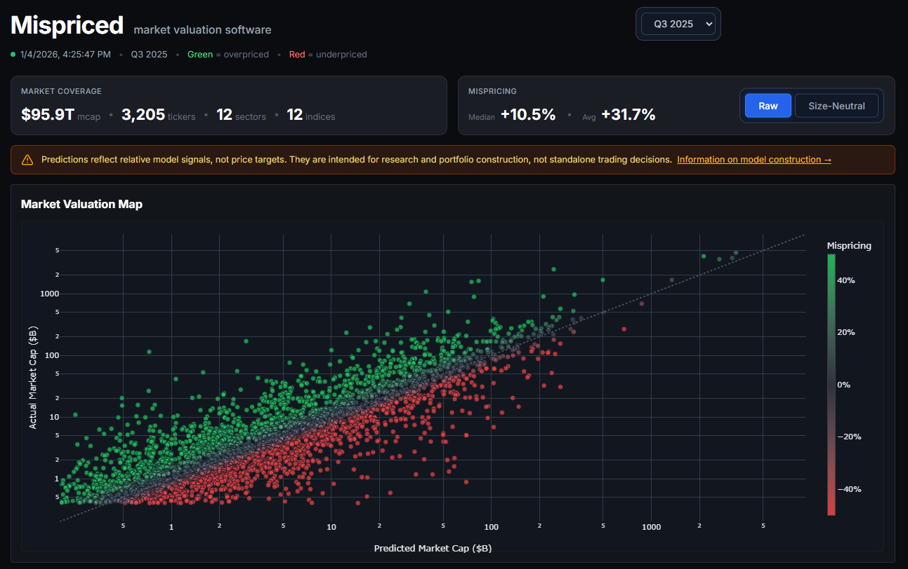

# Mispriced

A system that predicts fair market capitalization from financial statements and identifies mispriced securities.



## What It Does

**Mispriced** answers the question: *"Given these fundamentals, what should this company be worth?"*

- Predicts fair market cap from balance sheet data (revenue, EBITDA, debt, cash flow, etc.)
- Identifies mispriced securities by comparing predicted vs. actual market caps
- Tracks mispricing across global indices (S&P 500, NASDAQ 100, DAX, FTSE 100, etc.)
- Provides uncertainty estimates for every prediction

This is **not** a price forecaster. It's a financial audit tool that values companies based on fundamentals.

## Design Philosophy

**What this system is:**
- Fair value estimator from financial fundamentals
- Mispricing detector via cross-sectional comparison
- Index-level analyzer with uncertainty quantification

**What this system is NOT:**
- Time-series price predictor (no OHLCV modeling)
- Daily return forecaster (rebalances quarterly)
- Technical analysis tool (fundamentals only)

**Key principles:**
1. **Financial audit mindset** — Predict what companies *should* be worth
2. **Uncertainty quantification** — Every prediction has confidence intervals
3. **No data leakage** — Out-of-fold predictions ensure fair evaluation
4. **Currency normalization** — All values converted to USD

## How It Works

### Repeated Cross-Validation

The model uses **repeated K-fold cross-validation** to generate fair predictions with uncertainty:

```
For each of N repeats (N=10):
    Split data into K folds (K=5)
    For each fold:
        Train XGBoost on K-1 folds
        Predict on held-out fold

Final prediction for each ticker:
    μ = mean of all out-of-fold predictions
    σ = std of all out-of-fold predictions
```

This produces a **distribution of predictions** for each ticker, capturing model uncertainty without data leakage.

### Mispricing Calculation

Relative error measures how much a security deviates from fair value:

```
Relative Error = (Predicted - Actual) / Actual
```

- **Positive** → Underpriced (model thinks it's worth more)
- **Negative** → Overpriced (model thinks it's worth less)

### Features

The model uses ~30 fundamental features:
- **Income**: Revenue, Gross Profit, EBITDA, Operating Income, Net Income
- **Balance Sheet**: Total Debt, Total Cash, Total Assets, Book Value
- **Cash Flow**: Free Cash Flow, Operating Cash Flow, CapEx
- **Ratios**: Profit Margins, ROA, ROE, Debt-to-Equity, Quick Ratio

No price-derived features are used — only accounting fundamentals.

## Quick Start

```bash
# Install dependencies
pip install -r requirements.txt

# Run valuation pipeline (all quarters)
python scripts/run_quarterly_valuation.py

# Generate dashboard data
python scripts/generate_dashboard.py

# Build and serve web dashboard
cd web && npm install && npm run dev
```

## Web Dashboard

The dashboard displays:
- **Valuation Map**: All stocks sized by market cap, colored by mispricing
- **Index Charts**: Historical mispricing trends for major indices
- **Quarter Browser**: Navigate through historical valuations

Built with Vite + TypeScript.

## Supported Indices

| Region | Indices |
|--------|---------|
| **US** | S&P 500, NASDAQ 100, S&P 400, S&P 600, Russell 1000 |
| **Europe** | DAX, FTSE 100, Euro Stoxx 50, CAC 40, SMI |
| **Asia** | Nifty 50, SSE 50 |

---

## Architecture

```
mispriced/
├── src/
│   ├── ingestion/      # Fetch financial data from yfinance
│   ├── db/             # SQLite database models
│   ├── valuation/      # XGBoost prediction + feature engineering
│   └── evaluation/     # Repeated CV implementation
├── scripts/
│   ├── run_quarterly_valuation.py   # Main valuation pipeline
│   └── generate_dashboard.py        # Export data for web
├── web/                # Vite + TypeScript dashboard
│   ├── src/            # Frontend source
│   └── public/         # Static JSON data
└── mispriced.db        # SQLite database
```

### Data Flow

```
yfinance API → ingestion → SQLite DB → valuation (XGBoost CV) → dashboard JSON → web
```

### Database Tables

| Table | Purpose |
|-------|---------|
| `tickers` | Company metadata (sector, industry, currency) |
| `financial_snapshots` | Point-in-time balance sheet data |
| `valuation_results` | Model predictions with uncertainty |
| `index_memberships` | Index constituent mappings |

---

## License

This project is licensed under the GNU General Public License v3.0 — see [LICENSE](LICENSE) for details.
